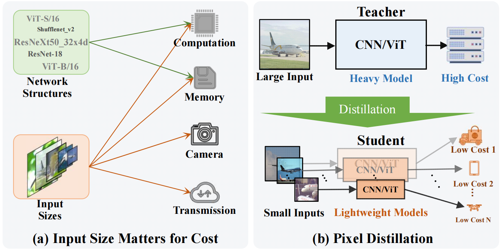
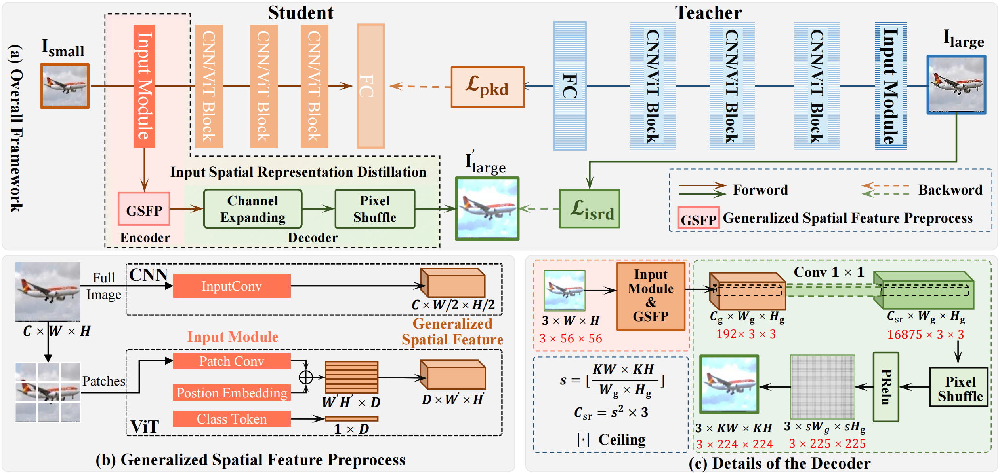

## The official code for paper:  ["Pixel Distillation: Cost-flexible Distillation across Image Sizes and Heterogeneous Networks", TPAMI 2024.](https://ieeexplore.ieee.org/document/9437331)
---

## 1. INTRODUCTION
Pixel Distillation is a cost flexible distillation framework, adept at accommodating diverse image sizes and heterogeneous network architectures, thereby enabling adaptive and efficient cost reduction across varied settings.

<!--  -->
### News and Updates
**2024.07.01**

- Papaer has been accepted by TPAMI.

**2024.08.10**
- Code for CUB and Aircraft is released.

**2024.08.23**
- Code for teacher-student (TS), one-stage pixel distillation
- Code for previous methods, including KD AT DKD ICKD SP

**Tode**
- Two-stage pixel distillation (TAS) Classification.
- Two-stage pixel distillation (TAS) Object Detection.
---

## 2. Training
```bash
# List of packages
python=3.9
pytorch=1.12.1
torchvision=0.13.1
timm=0.6.5
tensorboard=2.17.0
pillow=10.2.0
pyyaml=6.0.1
scikit-learn=1.5.1
```

### 2.1. Baseline (Teacher/Student)
**Teacher networks** are trained only once with fixed seed 0. For example, to train ResNet50 teacher network on CUB dataset
```bash
python tools_0_base/train_teacher_1run.py --config_file configs/base/cub/cub_resnet_single_224.yaml BASIC.SEED 0 BASIC.GPU_ID [0]
```
**Student networks** are trained  5 times. For example, to train ViT-tiny with 56 size student network on CUB dataset
```bash
python tools_0_base/train_student_5runs.py --config_file configs/base/cub/cub_vit_single_56.yaml MODEL.ARCH vit_tiny_patch16_56 BASIC.GPU_ID [0]
```

Note that for ViT models, changing input resolution needs to change the definition of in `lib/models/vit.py`

All available models can be found in `lib/models/model_builder.py`

### 2.2. One-stage Pixel Distillation (Teacher-Student)


<!-- {:height="50px" width="100px"} -->

#### Previous KD method

**KD methods** are trained  5 times. For example, using **AT** to train resnet50-teacher and resnet18-student with 56 size (LESSEN_RATIO=224/56=4.0) student network on CUB dataset
```bash
python tools_1_ts/train_kd_5runs.py --config_file configs/ts/cub/cub_resnet50_resnet_kd.yaml   MODEL.KDTYPE 'at' MODEL.ARCH_T 'resnet50' MODEL.MODELDICT_T 'ckpt/cub/1runs_resnet50_224_seed0_0.01/ckpt/model_best.pth' MODEL.ARCH_S 'resnet18' DATA.LESSEN_RATIO 4.0 BASIC.GPU_ID [0]
```


#### Our method

**Our methods** are trained  5 times. For example, to train resnet50-teacher and resnet18-student with 56 size student network on CUB dataset: LESSEN_RATIO=224/56=4.0, ETA=50
```bash
python tools_1_ts/train_isrd_5runs.py --config_file configs/ts/cub/cub_resnet50_resnet_isrd.yaml  MODEL.ARCH_T 'resnet50' MODEL.MODELDICT_T 'ckpt/cub/1runs_resnet50_224_seed0_0.01/ckpt/model_best.pth' MODEL.ARCH_S 'resnet18' DATA.LESSEN_RATIO 4.0 FSR.ETA 50.0 BASIC.GPU_ID [0]
```


### Citation
```
@ARTICLE{guo2024pixel,
  author={Guo, Guangyu and Zhang, Dingwen and Han, Longfei and Liu, Nian and Cheng, Ming-Ming and Han, Junwei},
  journal={IEEE Transactions on Pattern Analysis and Machine Intelligence}, 
  title={Pixel Distillation: Cost-flexible Distillation across Image Sizes and Heterogeneous Networks}, 
  year={2024},
  volume={},
  number={},
  pages={1-15},
  doi={10.1109/TPAMI.2024.3421277}}

```
